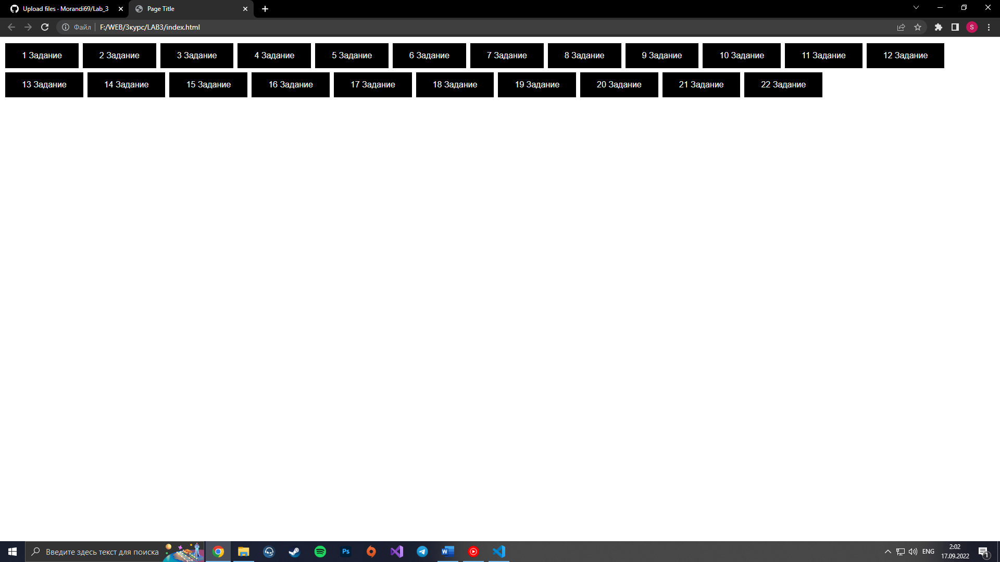
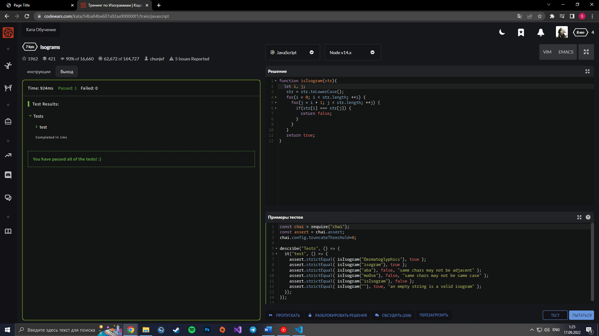
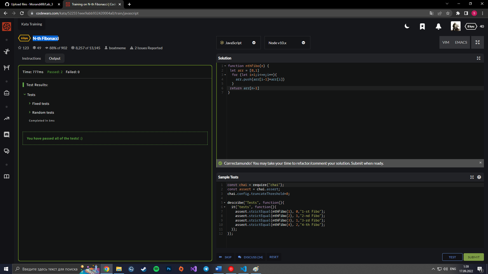
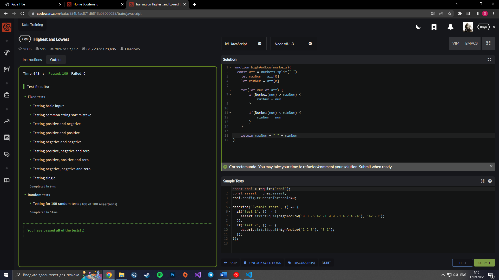
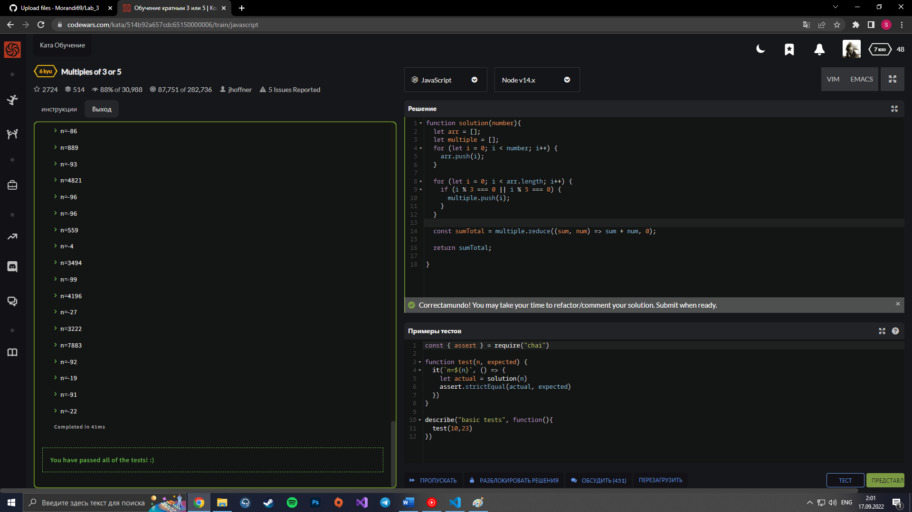
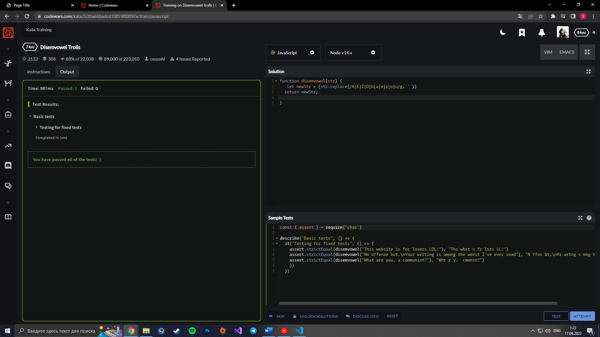
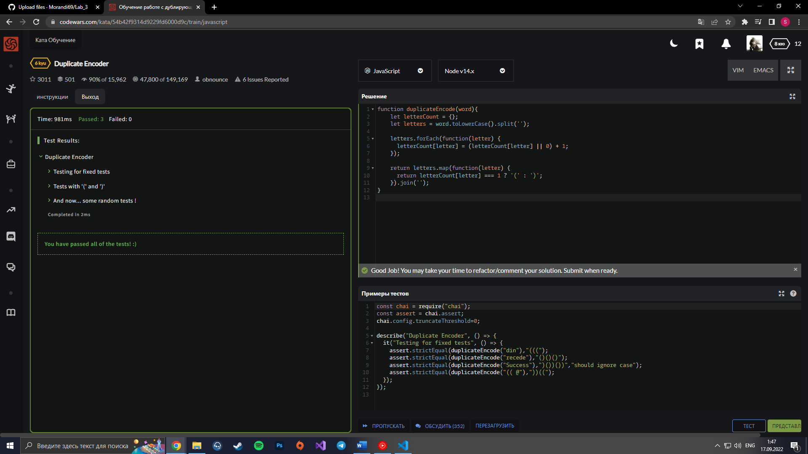

# Лабораторная работа №3
## «Основы языка JavaScript»
### Решение:

    function task1(){
        alert( null || 2 || undefined );1
    }

    function task2(){
        alert( alert(1) || 2 || alert(3) );
    }

    function task3(){
        alert( 1 && null && 2 );
    }

    function task4(){
        alert( alert(1) && alert(2) );
    }

    function task5(){
        alert( null || 2 && 3 || 4 );
    }

    function task6(age){
        if(age>=14 && age<=90){
            idfirst.innerHTML=age+" В границе между 14 и 90";
        }
        else{
            idfirst.innerHTML="false";
        }

    }

    function task7(age){
        if(age<=14 || age>=90){
            idfirst.innerHTML=age+" НЕ В границе между 14 и 90";
        }
        else{
            idfirst.innerHTML="true";
        }

    }
    function task8(){
        if (-1 || 0) alert( 'first' );
        if (-1 && 0) alert( 'second' );
        if (null || -1 && 1) alert( 'third' );
    }

    function task9(){
        let userName = prompt("Кто там?", '');

        if (userName === 'Админ') {

        let pass = prompt('Пароль?', '');

        if (pass === 'Я главный') {
            alert( 'Здравствуйте!' );
        } else if (pass === '' || pass === null) {
            alert( 'Отменено' );
        } else {
            alert( 'Неверный пароль' );
        }

        } else if (userName === '' || userName === null) {
        alert( 'Отменено' );
        } else {
        alert( "Я вас не знаю" );
        }
    }

    function task10(){
        let i = 3;
        while (i) {
        alert( i-- );
        }
    }

    function task11(){
        let i = 0;
        idfirst.innerHTML="Постфиксная форма: "
        while (++i < 5) idfirst.innerHTML+=i+"; ";

        //Постфиксный вариант i++

        let j = 0;
        idfirst2.innerHTML="Префиксная форма: "
        while (j++ < 5) idfirst2.innerHTML+=j+"; ";

    }

    function task12(){

        idfirst.innerHTML="Постфиксная форма: "
        for (let i = 0; i < 5; i++) idfirst.innerHTML+=i+"; ";

        idfirst2.innerHTML="Префиксная форма: "
        for (let i = 0; i < 5; ++i) idfirst2.innerHTML+=i+"; ";

    }

    function task13(){
        idfirst.innerHTML="Четные числа от 2 до 10: ";
        for (let i = 2; i < 11; ++i){
            if(i%2==0){
                idfirst.innerHTML+= i+ "; ";
            }
        }
    }
    function task14(){
        let i=0;
        while (i<3) {
            alert( `number ${i}!` );
            i++;
          }

    }

    function task15(){
        let x;
        while(x!=100){
            x = prompt("Введите 100", '');
        }
    }

    function task16(){

        let n = 10;
        idfirst.innerHTML="Натуральные числа от 2 до "+ n+": ";
        nextPrime:
        for (let i = 2; i <= n; i++) 
        { 
            for (let j = 2; j < i; j++) 
            { 
                if (i % j == 0) continue nextPrime; 
            }
        idfirst.innerHTML+=i+"; "; 
        }
    }

    function task17(browser){
        if(browser=="Edge"){
            alert( "You've got the Edge!" );
        }
        else if(browser=="Chrome"||"FireFox"||"Safari"||"Opera"){
            alert( 'Okay we support these browsers too' );
        }
    }
    function task18(){
        const number = +prompt('Введите число между 0 и 3', '');
        switch(number){
            case 0:alert('Вы ввели число 0');
            break;
            case 1:alert('Вы ввели число 1');
            break;
            case 2:alert('Вы ввели число 2');
            break;
            case 3:alert('Вы ввели число 3');
        }
    }
    function task19(){
        let age=prompt('Введите свой возраст');
        idfirst.innerHTML=checkAge(age);
    }

    function checkAge(age) {
        if (age > 18) {
          return true;
        } 

          return confirm('Родители разрешили?');

      }

      function task20(){
        let age=prompt('Введите свой возраст');
        idfirst.innerHTML=checkAge2(age);

      }

      function checkAge2(age) {
        return (age > 18) ? true : confirm('Родители разрешили?');
      }

      function task21(){
        let x=prompt('Введите 1 число');
        let y=prompt('Введите 2 число');
        idfirst.innerHTML="Меньшее "+ min(x,y);

      }
      function min(x,y){
        if(x<y){
            return x;
        }
        return y;
      }
      function task22(){
        let x=3;
        let n=3;
        idfirst.innerHTML=x+ "В Степени " + n+" = "+pow(x,n)
      }
      function pow(x,n){
        let result=x;
        for (let i = 1; i < n; i++)
        {
            result*=x;
        }
        return result;
      }

### Задания с CodeWars
#### Isograms

#### N-th Fibonacci

#### Highest and Lowest

#### Multiples of 3 or 5

#### Disemvowel Trolls

#### DuplicateEncoder

